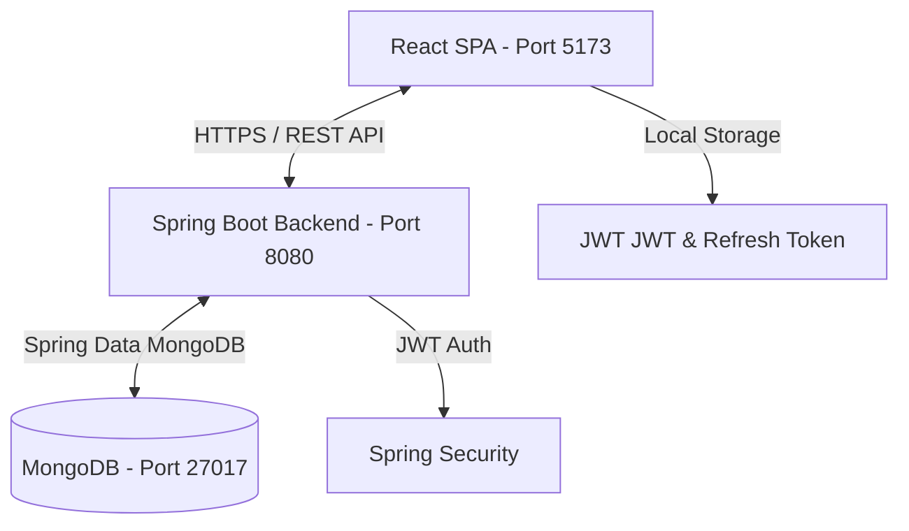

# Project Architecture - Premium SaaS Habit Tracker

This document outlines the system architecture, directory layouts, and design patterns for the production-grade Habit Tracker.

---

## 1. High-Level System Architecture

The application is built on a decoupled full-stack architecture with a React-based Single Page Application (SPA) frontend and a Java 21 / Spring Boot 3.x REST API backend. Persistence is handled by MongoDB, utilizing a document database approach suitable for habit tracking logs, dynamic scheduling, and flexible notification templates.



---

## 2. Technical Stack Decisions

### Frontend
* **Core**: React 18, Vite (for ultra-fast development and optimized production bundling).
* **Routing**: React Router DOM v6 for protected and public routing.
* **Styling**: Tailwind CSS + Material UI (MUI). Combining Tailwind's utility-first classes for custom glassmorphic elements and layouts, with MUI's powerful components (Icons, Date/Time pickers, and Modal overlays).
* **Animations**: Framer Motion for smooth transitions, card hovers, modal animations, and toggle micro-animations.
* **State Management**: React Context API for global states (Auth Context, Theme Mode, Notifications Context).
* **Data Fetching**: Axios with interceptors for automatic JWT attachment and token refresh mechanisms.
* **Charts**: Recharts for responsive, beautiful data visualizations (Progress charts, streak trends, productivity graphs).

### Backend
* **Runtime**: Java 21 (leveraging modern features like Records, pattern matching, and enhanced collection APIs).
* **Framework**: Spring Boot 3.x (Web, Security, Data MongoDB, Validation).
* **Security**: Spring Security + Stateless JWT authentication (supporting access tokens and refresh tokens).
* **Persistence**: Spring Data MongoDB (handling indexes, aggregation queries, and life-cycle events).
* **Utilities**: Lombok (boilerplate removal) and MapStruct (type-safe, high-performance object mapping between Entities and DTOs).
* **Build System**: Maven 3.x.

---

## 3. Directory Layouts

### Frontend Structure (`/frontend`)
```
frontend/
├── public/
├── src/
│   ├── assets/             # Images, static media, fonts
│   ├── components/         # Reusable presentation components (Card, Buttons, Modal, Heatmap)
│   ├── context/            # AuthContext, ThemeContext, AlertContext
│   ├── hooks/              # Custom React hooks (useAuth, useNotification)
│   ├── layouts/            # Page layouts (DashboardLayout, AuthLayout, LandingLayout)
│   ├── pages/              # Page components (Landing, HabitMonitor, Schedule, Dashboard, Profile, Settings)
│   ├── routes/             # Route configurations, PublicRoute, PrivateRoute guards
│   ├── services/           # Axios client, authService, habitService, scheduleService
│   ├── store/              # State store (optional Redux/Zustand configs)
│   ├── utils/              # Helper utilities (date helpers, formatter, exports)
│   ├── App.jsx             # Main Application Entry Component
│   ├── index.css           # Global Tailwind and premium custom CSS variables
│   └── main.jsx            # React DOM mounting entrypoint
├── package.json
├── tailwind.config.js
└── vite.config.js
```

### Backend Structure (`/backend`)
```
backend/
├── src/
│   ├── main/
│   │   ├── java/
│   │   │   └── com/
│   │   │       └── habittracker/
│   │   │           ├── config/          # CORS, MongoConfig, AppConfig
│   │   │           ├── controller/      # REST API Controllers (Auth, Habit, Schedule, Dashboard)
│   │   │           ├── dto/             # Request/Response payloads (AuthDTO, HabitDTO, ScheduleDTO)
│   │   │           ├── entity/          # MongoDB Document Models (User, Habit, HabitLog, Schedule, Achievement)
│   │   │           ├── exception/       # Global Exception Handler and custom exceptions
│   │   │           ├── mapper/          # MapStruct DTO-Entity mappers
│   │   │           ├── repository/      # Spring Data Mongo Repositories (UserRepository, HabitRepository, etc.)
│   │   │           ├── security/        # JWT Filter, UserDetailsService, AuthProvider
│   │   │           └── service/         # Core business logic interfaces and implementations
│   │   └── resources/
│   │       ├── application.properties   # Database connections, JWT configuration keys, ports
│   │       └── templates/               # Optional email templates
│   └── test/                            # Integration and unit tests
├── pom.xml
└── mvnw
```

---

## 4. Key Architectural Patterns

1. **DTO Pattern**: Entities represent database rows and are never exposed directly to the REST API layers. MapStruct creates compile-time, zero-reflection mapping methods to convert between Entities and DTOs.
2. **Stateless Authentication**: Security is fully stateless. The frontend stores the access token in memory/state and the refresh token securely in `localStorage` or `HttpOnly` cookies. Request filters validate JWT tokens on every secure API call.
3. **Repository Pattern**: Extends `MongoRepository` for clean CRUD access. Complex aggregation pipelines (for heatmaps, completion rates, and streak calculations) are isolated in custom repository implementations or service-level aggregations.
4. **Global Exception Handling**: A centralized `@ControllerAdvice` maps exceptions (e.g. `ResourceNotFoundException`, `BadCredentialsException`) into consistent, developer-friendly JSON error payloads.
