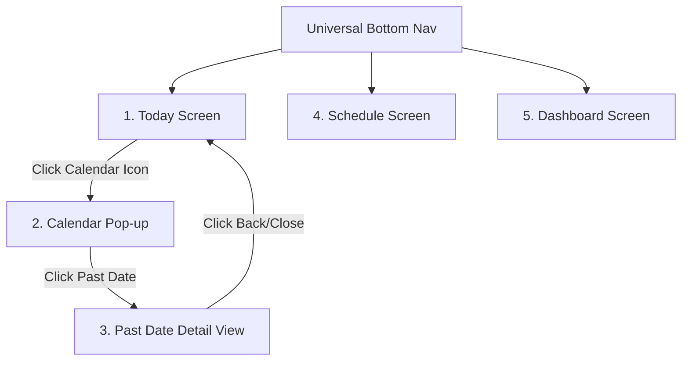

# UI / UX Plan - Premium SaaS Habit Tracker

This document details the visual guidelines, typography, component hierarchies, and interactive workflows of the Habit Tracker. The design is inspired by high-end products like Linear and Notion, combined with the layout principles shown in the reference image.

---

## 1. Visual Theme & Style Guidelines

To achieve a "premium, state-of-the-art" feel, the interface uses a dark-glassmorphic style by default, with an optional sleek, soft-contrast light mode.

### HSL Design Token Palette
```css
:root {
  /* Brand Colors */
  --primary: 246 98% 68%;       /* #6D5DFE - Sleek Indigo */
  --secondary: 261 95% 66%;     /* #8B5CF6 - Premium Purple */
  --success: 142 72% 45%;       /* #22C55E - Success Green */
  --danger: 0 84% 60%;          /* #EF4444 - Coral Red */
  --warning: 38 92% 50%;        /* #F59E0B - Warning Amber */

  /* Dark Theme Tokens (Default UI) */
  --bg-app: 222 47% 11%;        /* #0F172A - Deep Slate */
  --bg-card: 222 47% 16% / 0.7; /* Glass-like dark background */
  --border-card: 217 32% 22% / 0.5;
  --text-primary: 210 40% 98%;   /* Clear Off-White */
  --text-secondary: 215 20% 65%; /* Soft Slate Grey */
  --glass-blur: 16px;
}

.light-mode {
  /* Light Theme Tokens */
  --bg-app: 210 40% 98%;        /* #F8FAFC - Soft Off-White */
  --bg-card: 0 0% 100% / 0.8;   /* Glass-like white background */
  --border-card: 214 32% 91% / 0.6;
  --text-primary: 222 47% 11%;  /* Deep Slate */
  --text-secondary: 215 16% 47%; /* Muted Slate Grey */
}
```

---

## 2. Components Hierarchy & Screens (From Reference Image)

Our application implements a mobile-first responsive layout (collapsible sidebar for desktop, sleek bottom nav for mobile) that matches the four states in the reference image:



### 1. Today Screen (Primary View)
* **Universal Top Bar**: Profile name ("Arun Kumar"), avatar image, and a calendar action button in the top-right.
* **Header Section**: Displays the current day ("Monday, Oct 28"), dynamic counts ("My Habits: 6/8 Done"), and a smooth circular progress indicator indicating daily progress.
* **Habit List Cards**: Displays dynamic habit cards with:
  * Left: Category-colored background icon box (e.g. soft orange for Fitness, soft blue for Water, soft purple for Meditation).
  * Center: Habit Name ("Morning Yoga", "Read 15 Pages") and goal progress tracker ("20m", "12/15 Pages", "5/8 Glasses").
  * Right: Styled interactive checkbox with scale-up micro-animations.
* **Streak Banner**: A dedicated section at the bottom tracking the user's active habit streaks ("Streak 🔥 Yoga: 14 days").
* **Floating Action Button (`+`)**: Standard floating button in the bottom-right that pops open the **Add Habit Modal**.

### 2. Calendar Pop-up View
* Triggered by clicking the calendar icon on the Today Screen.
* Renders a highly interactive monthly card grid.
* Dates with successful check-ins display a green border and pulse glow.
* Includes navigation controls (`<` and `>`) to toggle months.

### 3. Past Date Detailed Progress View
* Triggered by clicking any past date in the **Calendar Pop-up View**.
* Replaces the Today's Habit view temporarily with a focused past-log list.
* Displays a clear header: `PAST DATE DETAILED PROGRESS VIEW (DATE: OCT 25)`.
* Lists all habits and their completed status at that exact historical date, with a "Back/Close" action to return to Today.

### 4. Schedule Screen (Planner View)
* Features day, week, and month calendars with event scheduling.
* Displays a time-blocked schedule layout (e.g., `07:00 AM - Morning Yoga`, `09:00 AM - Stand-up Meeting`, `12:00 PM - Deep Work Session`).
* Cards are color-coded by event type and support drag-and-drop to reschedule time blocks.
* Inline completion checkboxes to check off tasks in real-time.

### 5. Dashboard Screen (Analytics Hub)
* **Streak & Completion Cards**: High-level KPIs displaying current active streaks, total habits tracked, and monthly completion percentage.
* **Weekly Progress Chart**: Recharts bar graph displaying daily percentage completion.
* **Monthly Heatmap Grid**: A custom SVG grid mapping out the current month's completion rates (GitHub contribution style) from transparent (0%) to deep emerald green (100%).
* **Consistency Area Charts**: Interactive area graphs tracking consistency over time for individual habits (e.g., Reading, Meditation).

---

## 3. Framer Motion Animation Rules
* **Page Transitions**: Smooth horizontal slides on tab switches.
* **Habit Completion Check**: Confetti burst or checkbox scale-up (`scale: [1, 1.2, 1]`) on checked.
* **Modal Overlay**: Backdrop blur transitions (`opacity: [0, 1]`) and panel pop-up (`scale: [0.95, 1]`, `y: [10, 0]`).
* **Card Hover**: Cards scale up by `1.02` with a subtle glow-shadow shift on hover.
